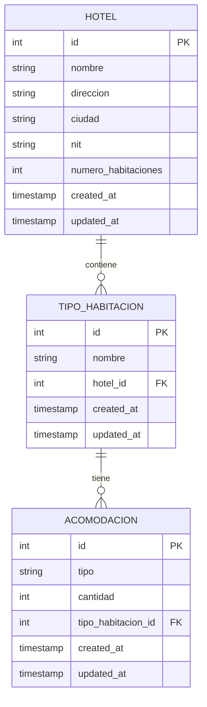
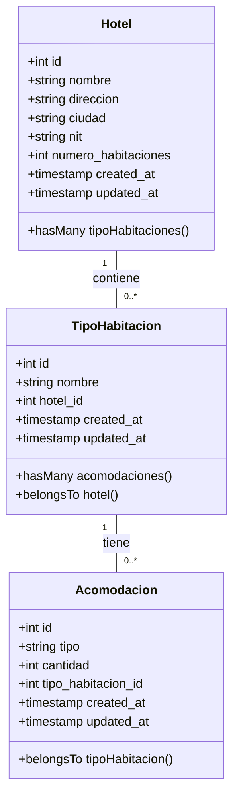

# Documentacion

HOTELES DECAMERON DE COLOMBIA
Dirección de Desarrollo

Hola ingenier@, que bueno tenerlo en la empresa, le comento que el gerente de operaciones
hoteleras requiere un sistema que permita ingresar los hoteles con los que cuenta la compañía,
además de los nombres básicos del hotel, se deben ingresar los datos tributarios básicos.
Adicional a eso el gerente hotelero requiere que a los hoteles con los que cuenta la compañía,
se les pueda asignar los tipos de habitación (Estándar, Junior y Suite). Este sistema debe validar
que únicamente se pueda asignar las acomodaciones según el tipo:
- Si el tipo de habitación es Estándar: la acomodación debe ser Sencilla o Doble.
- Si el tipo de habitación es Junior: la acomodación debe ser Triple o Cuádruple
- Si el tipo de habitación es Suite: la acomodación debe ser Sencilla, Doble o Triple
  Ejemplo:

| | | ||
|---|---|---|---|
|Nombre: |DECAMERON CARTAGENA| DIRECCIÓN: |CALLE 23 58-25|
|Ciudad: |CARTAGENA |NIT: |12345678-9|
|Numero de Hab: |42|||

|CANTIDAD| TIPO HABITACIÓN |ACOMODACIÓN|
|---|---|---|
|25 |ESTANDAR |SENCILLA|
|12|JUNIOR|TRIPLE|
|5| ESTANDAR| DOBLE|

### Criterios de Aceptación:

1. La cantidad de habitaciones configuradas, no deben superar el máximo por hotel
    - Debemos asegurarnos de que el número total de habitaciones configuradas en las acomodaciones no exceda el número de habitaciones del hotel.
2. No deben existir hoteles repetidos
    - Debemos asegurarnos de que no haya duplicación de hoteles, verificando por campos como nombre, direccion, ciudad, y nit.
3. No debe existir tipos de habitaciones y acomodaciones repetidas para el mismo hotel
    - Debemos asegurarnos de que no haya duplicación de tipos de habitación y acomodaciones para el mismo hotel.
4. No se requieren administradores para datos catálogos, como ciudades, tipos de habitación o acomodación
    - Esto implica que estos datos no necesitan ser gestionados por usuarios administradores y pueden ser predefinidos o gestionados de manera interna.
5. Los gerentes usan portátiles de 15 y algunos casos de 13 pulgadas.
    
### Criterios técnicos de aceptación:
- La aplicación debe ser totalmente RESTFULL.
- El back y el front deben estar desacoplados
- El back debe ser en PHP
- Entregar la documentación del proyecto que considere importante (por ejemplo:
  diagramas UML).
- La base de datos debe ser postgresql
- La aplicación debe desplegarse en la nube (puede utilizar la nube que desee). Se debe
  enviar el link para acceder a la aplicación.
- Se debe enviar el código realizado en un archivo comprimido o compartirlo en un
  repositorio GIT público para poder descargarlo.
- La aplicación se usará en navegadores Firefox y Chrome
- Considere buenas prácticas como: patrones de diseño, principios SOLID, código
  documentado, otros).
### Favor no olvidar:
- Enviar dump de la BD, lista para instalar.
- Se debe enviar el paso a paso para ejecutar la aplicación, como si su abuelita quisiera
  realizar el depliegue ☺.

## Introduccion
## Sistema de Gestión Hotelera

Este proyecto es un sistema de gestión hotelera desarrollado con Laravel en el backend y React en el frontend. Permite a los gerentes de operaciones hoteleras ingresar y administrar los hoteles, tipos de habitaciones y sus acomodaciones.

## Tecnologías Utilizadas
- **Backend**: PHP con el framework Laravel
- **Frontend**: React
- **Base de Datos**: PostgreSQL
- **Despliegue**:  Heroku

## Instalación y Configuración

### Requisitos Previos
- PHP 8.2
- Composer
- Node.js
- PostgreSQL

### Clonar el Repositorio

=====>>>>>>>>>>falta<<<<===========

```sh
git clone 
cd
```

## configuracion del backend

### instalar dependencias

```sh
composer install
```

### Configurar el Archivo .env
```sh
cp .env.example .env
```

### Generar la Clave de la Aplicación
```sh
php artisan key:generate
```

### Configurar la Base de Datos en el Archivo .env
```markdown
DB_CONNECTION=pgsql
DB_HOST=127.0.0.1
DB_PORT=5432
DB_DATABASE=hotel_system
DB_USERNAME=postgres
DB_PASSWORD=1234
```

### Migrar las Tablas
```sh
php artisan migrate
```

## Configuracion del Front

### Instalar Dependencias
```sh
npm install
```

### Iniciar el Servidor de Desarrollo
```sh
npm start
```

### 3. **Uso de la API**

en test esta una prueba unitaria o esta las pruebas en api_test.http

```markdown 
## Uso de la API 
### Endpoints A continuación se presentan los endpoints disponibles en el sistema: 

#### Hoteles 

- **Crear un nuevo hotel** 

http 
POST /api/hotels 
{ 
    "nombre": "Hotel Test", 
    "direccion": "123 Calle Principal", 
    "ciudad": "Bogotá", 
    "nit": "123456789", 
    "numero_habitaciones": 100 
    }
```

- Obtener todos los hoteles
  GET /api/hotels

- Obtener un hotel por ID
  GET /api/hotels/{id}


- Actualizar un hotel por ID
  PUT /api/hotels/{id}
  {
  "nombre": "Hotel Actualizado",
  "direccion": "123 Calle Principal",
  "ciudad": "Bogotá",
  "nit": "123456789",
  "numero_habitaciones": 150
  }

- Eliminar un hotel por ID
  DELETE /api/hotels/{id}

## Tipos de Habitación
- Crear un nuevo tipo de habitación
  POST /api/tipos-habitacion
  {
  "tipo": "Estándar"
  }

- Obtener todos los tipos de habitación
  GET /api/tipos-habitacion
- Obtener un tipo de habitación por ID
  GET /api/tipos-habitacion/{id}
- Actualizar un tipo de habitación por ID
  PUT /api/tipos-habitacion/{id}
  {
  "tipo": "Junior"
  }
- Eliminar un tipo de habitación por ID
  DELETE /api/tipos-habitacion/{id}

## Acomodaciones

- Crear una nueva acomodación
  POST /api/acomodaciones
  {
  "tipo_habitacion_id": 1,
  "tipo": "Sencilla",
  "cantidad": 25
  }
- Obtener todas las acomodaciones
  GET /api/acomodaciones
- Obtener una acomodación por ID
  GET /api/acomodaciones/{id}
- Actualizar una acomodación por ID
  PUT /api/acomodaciones/{id}
  {
  "tipo": "Doble",
  "cantidad": 30
  }
- Actualizar una acomodación por ID
  PUT /api/acomodaciones/{id}
  {
  "tipo": "Doble",
  "cantidad": 30
  }

- Eliminar una acomodación por ID
  DELETE /api/acomodaciones/{id}


## MER
# Modelo Entidad-Relación (ERD)



- Definición de Entidades: Definimos las tablas HOTEL, TIPO_HABITACION y ACOMODACION con sus atributos y claves primarias (PK) y foráneas (FK).
- Relaciones:
    - HOTEL contiene (||--o{) muchas TIPO_HABITACION.
    - TIPO_HABITACION tiene (||--o{) muchas ACOMODACION.

## diagramas de Clase

# Diagrama de Clases



## Despliegue

### Pasos para Desplegar la Aplicación
1. Configurar la base de datos en la nube.
2. Desplegar la aplicación en un servicio de hosting.
3. Actualizar las variables de entorno (.env).
4. Migrar las tablas de la base de datos.
5. Probar la aplicación en producción.

### Despliegue en Heroku
```sh
heroku login
git init
git add .
git commit -m "Initial commit"
heroku create nombre-de-tu-app
heroku buildpacks:set heroku/php
git push heroku main
heroku run php artisan migrate
heroku open
```
