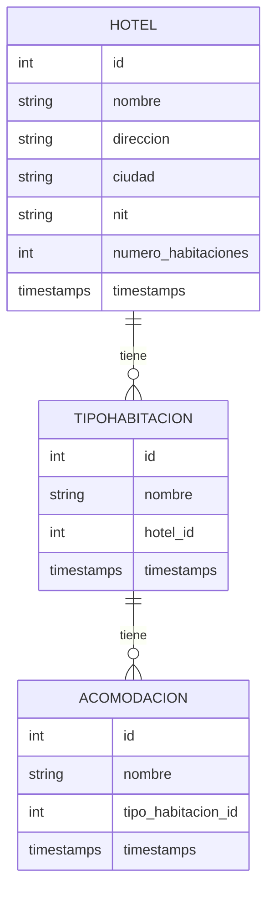

H

## mermaid posible de relaciones

### Explicación del Diagrama

- **HOTEL**: Representa la tabla de hoteles.
    - Relación: Un hotel (HOTEL) puede tener múltiples tipos de habitación (TIPOHABITACION).

- **TIPOHABITACION**: Representa la tabla de tipos de habitación.
    - Relación: Un tipo de habitación (TIPOHABITACION) puede tener múltiples acomodaciones (ACOMODACION).

- **ACOMODACION**: Representa la tabla de acomodaciones.

.--.-.-.-.-.-.-.-.-.-.-.-.-.-.-.-.-.-.-.-.-.-.-.-.-.-.-.-.-.-.-..*.*.*.*.*.*.*.*.*.*.*.*.*.*-*--**--*-*-*-*-*-*-*-*-*-*-*-

vamos a revisar todo punto a punto para asegurarnos de que el proyecto esté sólido y listo. Podemos revisar los siguientes aspectos:

Estructura del Proyecto:

Verificar que todas las carpetas y archivos necesarios estén presentes.

Asegurarnos de que los archivos clave como RouteServiceProvider.php, Kernel.php, y el middleware estén configurados correctamente.

Rutas y Controladores:

Revisar que las rutas de la API estén funcionando correctamente.

Verificar que los controladores estén bien configurados y que las acciones (index, store, show, update, destroy) estén funcionando como se espera.

Modelos y Migraciones:

Confirmar que los modelos y sus migraciones estén correctamente configurados.

Asegurarnos de que las tablas en la base de datos estén actualizadas y reflejen los cambios.

Pruebas:

Ejecutar pruebas básicas para verificar que las funcionalidades principales del API estén funcionando correctamente.

Documentación:

Asegurarnos de que la documentación del código y los comentarios estén presentes y sean claros.

Requisitos del Sistema:
Ingreso de Hoteles con Datos Básicos y Tributarios:

Nombre del Hotel: ✔️

Dirección: ✔️

Ciudad: ✔️

NIT: ✔️

Número de Habitaciones: ✔️

Asignación de Tipos de Habitación con Validación de Acomodaciones:

Estándar: Sencilla o Doble

Junior: Triple o Cuádruple

Suite: Sencilla, Doble o Triple

Verificación de Funcionalidades Implementadas
1. Modelo y Controlador de Hoteles
   Modelo Hotel:

Campos requeridos (nombre, direccion, ciudad, nit, numero_habitaciones) están definidos.

Controlador HotelController:

Métodos index, store, show, update y destroy están implementados para manejar operaciones CRUD.

2. Modelo y Controlador de Tipos de Habitación
   Modelo TipoHabitacion:

Campo tipo está definido.

Relación con Acomodacion está definida.

Controlador TipoHabitacionController:

Métodos index, store, show, update y destroy están implementados para manejar operaciones CRUD.

3. Modelo y Controlador de Acomodaciones
   Modelo Acomodacion:

Campos requeridos (tipo_habitacion_id, tipo) están definidos.

Relación con TipoHabitacion está definida.

Controlador AcomodacionController:

Métodos index, store, show, update y destroy están implementados para manejar operaciones CRUD.

Validaciones específicas para acomodaciones según el tipo de habitación están implementadas en store y update.

Criterios Técnicos de Aceptación
Vamos a revisar y asegurarnos de que nuestra aplicación cumple con todos los criterios técnicos de aceptación mencionados.

1. La aplicación debe ser totalmente RESTFULL
   Verificación: Hemos implementado controladores con métodos estándar para CRUD (Crear, Leer, Actualizar, Eliminar) y asegurado que las rutas sigan las convenciones RESTful.

Ejemplo: Métodos como index, store, show, update, y destroy en nuestros controladores cumplen con este criterio.

2. El back y el front deben estar desacoplados
   Verificación: Estamos desarrollando el backend en PHP con Laravel, y el frontend puede ser desarrollado usando frameworks como React, Vue, o Angular. Esto asegura que el backend y el frontend estén desacoplados.

3. El back debe ser en PHP
   Verificación: Nuestro backend está implementado en PHP utilizando Laravel, que es uno de los frameworks más populares para PHP.

4. Entregar la documentación del proyecto que considere importante (por ejemplo: diagramas UML)
   Verificación: Asegúrate de incluir documentación completa en el repositorio del proyecto, incluyendo diagramas UML, guías de configuración, y cualquier otra documentación relevante.

5. La base de datos debe ser postgresql
   Verificación: Configuremos Laravel para usar PostgreSQL como base de datos. Esto se puede hacer en el archivo .env.

Ejemplo de configuración en .env:

DB_CONNECTION=pgsql
DB_HOST=127.0.0.1
DB_PORT=5432
DB_DATABASE=nombre_de_base_de_datos
DB_USERNAME=tu_usuario
DB_PASSWORD=tu_contraseña
6. La aplicación debe desplegarse en la nube (puede utilizar la nube que desee)
   Verificación: Podemos usar servicios como AWS, Azure, Google Cloud, o Heroku para desplegar la aplicación. Asegúrate de configurar el entorno de producción adecuadamente y proporcionar el enlace para acceder a la aplicación.

7. Se debe enviar el código realizado en un archivo comprimido o compartirlo en un repositorio GIT público
   Verificación: Crea un repositorio público en GitHub, GitLab o cualquier otra plataforma de control de versiones y asegúrate de que el código esté bien organizado y documentado.

8. La aplicación se usará en navegadores Firefox y Chrome
   Verificación: Asegúrate de probar la aplicación en ambos navegadores para garantizar la compatibilidad y la experiencia de usuario.

9. Considere buenas prácticas como: patrones de diseño, principios SOLID, código documentado, otros
   Verificación: Hemos seguido principios SOLID y patrones de diseño al desarrollar los controladores y modelos. Además, asegúrate de documentar el código adecuadamente para que sea fácil de entender y mantener.

Conclusión
Nuestra aplicación parece estar bien encaminada para cumplir con todos los criterios técnicos de aceptación. Asegúrate de probar la aplicación, documentar el código y proporcionar toda la información necesaria en el repositorio del proyecto.

tree -L 1 ./                                                                                                                                                                                                                  ─╯
./
├── api_test.http
├── app
│    ├── Http
│    │     ├── Controllers
│    │     │     ├── AcomodacionController.php
│    │     │     ├── Controller.php
│    │     │     ├── HotelController.php
│    │     │     └── TipoHabitacionController.php
│    │     ├── Kernel.php
│    │     └── Middleware
│    │         ├── ConvertEmptyStringsToNull.php
│    │         ├── CorsMiddleware.php
│    │         ├── EncryptCookies.php
│    │         ├── HandleCors.php
│    │         ├── PreventRequestsDuringMaintenance.php
│    │         ├── RedirectIfAuthenticated.php
│    │         ├── TrimStrings.php
│    │         ├── TrustProxies.php
│    │         └── VerifyCsrfToken.php
│    ├── Models
│    │     ├── Acomodacion.php
│    │     ├── Hotel.php
│    │     ├── TipoHabitacion.php
│    │     └── User.php
│    └── Providers
│    ├── AppServiceProvider.php
│    ├── AuthServiceProvider.php
│    ├── EventServiceProvider.php
│    └── RouteServiceProvider.php
├── artisan
├── bootstrap
├── composer.json
├── composer.lock
├── config
│    ├── app.php
│    ├── auth.php
│    ├── cache.php
│    ├── cors.php
│    ├── database.php
│    ├── filesystems.php
│    ├── logging.php
│    ├── mail.php
│    ├── queue.php
│    ├── services.php
│    └── session.php
├── database
│    ├── factories
│    │   ├── HotelFactory.php
│    │   └── UserFactory.php
│    ├── migrations
│    │   ├── 0001_01_01_000000_create_users_table.php
│    │   ├── 0001_01_01_000001_create_cache_table.php
│    │   ├── 0001_01_01_000002_create_jobs_table.php
│    │   ├── 2025_01_10_051816_create_hotels_table.php
│    │   ├── 2025_01_10_051849_create_tipo_habitaciones_table.php
│    │   └── 2025_01_10_051916_create_acomodacions_table.php
│    └── seeders
│    └── DatabaseSeeder.php
├── node_modules
├── package.json
├── package-lock.json
├── phpunit.xml
├── postcss.config.js
├── Prueba.md
├── public
├── README.md
├── resources
├── routes
│    ├── api.php
│    ├── channels.php
│    ├── console.php
│    └── web.php
├── schema.md
├── some.txt
├── storage
├── tailwind.config.js
├── tests
│     ├── Feature
│     │   ├── ExampleTest.php
│     │   └── HotelTest.php
│     ├── TestCase.php
│     └── Unit
│         └── ExampleTest.php
├── vendor
└── vite.config.js

